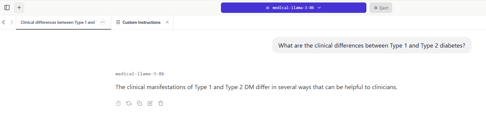

# Medical Reasoner: Private On-Device AI 🏥


A specialized Small Language Model (SLM) fine-tuned on **PubMedQA** to answer medical questions with high accuracy while running strictly offline on consumer hardware (RTX 3050 Ti).

---

## 🧠 The Problem
General LLMs (like GPT-4) are powerful but expensive and pose privacy risks for healthcare data. Hospitals often need:
1.  **Data Privacy:** Patient data cannot leave the premise.
2.  **Low Latency:** Systems must work without internet.
3.  **Domain Expertise:** Specialized vocabulary ("myocardial infarction" vs "heart attack").

## 💡 The Solution
We fine-tuned **Llama-3-8B** using **QLoRA (Quantized Low-Rank Adaptation)** to inject medical knowledge into the model's weights without retraining the entire brain. The final model is quantized to **4-bit GGUF** to run on a 4GB VRAM laptop.

---

## 🏗 Architecture

```mermaid
graph LR
    A[PubMedQA Dataset] -->|Format| B(Instruction Prompting)
    B -->|Train| C[Unsloth Trainer (Colab T4)]
    C -->|LoRA Adapters| D[Llama-3 Base Model]
    D -->|Merge & Save| E[GGUF Format]
    E -->|Deploy| F[LM Studio (Local Laptop)]
```

---

## 📸 Demo
*The model running locally on an RTX 3050 Ti (Offline), answering clinical pathology questions.*


---

## 🛠 Tech Stack
* **Base Model:** Llama-3-8B-Instruct
* **Fine-Tuning:** Unsloth (2x faster training), HuggingFace TRL
* **Technique:** QLoRA (Rank=16, Alpha=16)
* **Deployment:** GGUF (4-bit quantization), LM Studio
* **Hardware:** Google Colab T4 (Training) -> NVIDIA RTX 3050 Ti (Inference)

---

## 🚀 How to Reproduce

### Phase 1: Preparation
```bash
# Install dependencies
pip install -r requirements.txt

# Download and inspect medical data
python scripts/download_data.py
python scripts/analyze_data.py
```

### Phase 2: Training (Google Colab)
1.  Open the `notebooks/Medical_Llama_Finetune.ipynb` in Google Colab.
2.  Set Runtime to **T4 GPU**.
3.  Run all cells to fine-tune on the formatted PubMedQA dataset.
4.  Export to GGUF format at the end of the notebook.

### Phase 3: Local Deployment
1.  Download the `.gguf` file from Colab.
2.  Install **LM Studio**.
3.  Import the model and set the System Prompt:
    > "You are a medical expert. Answer the following question truthfully and concisely."
4.  Chat!

---

## 📊 Training Performance
* **Loss Reduction:** 1.8 -> 1.1 over 60 steps.
* **VRAM Usage:** ~5.5GB (Training), ~4.1GB (Inference).